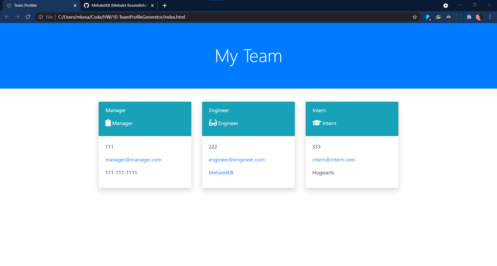

# 10-TeamProfileGenerator
 

  # Title: Team Profile Generator

  ## Table of Contents:
  * [Description](#description)
  * [Walk-through](#walk-through)
  * [Installation](#installation)
  * [Usage](#usage)
  * [Testing](#testing)
  * [Contact](#contact)

  ## Description: 
  This application generates a webpage displaying employee profiles based on user input
  

  ## Walk-through:
  https://www.dropbox.com/s/r1bfmi51n53lvag/10-TeamProfileGenerator.mp4?dl=0

  ## Installation:
  Must install node.js, inquirer and jest.

  ## Usage: 
  User will use node.js in the terminal to start question prompt. Once all questions are answered, user will select the "Create Team" to generate an HTML file with entered data.

  ## Testing: 
  Testing is done using Jest

  ## Contact: 
  Email: tatybcoding@gmail.com    
  Github: MehaletKB
